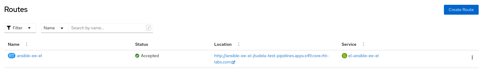
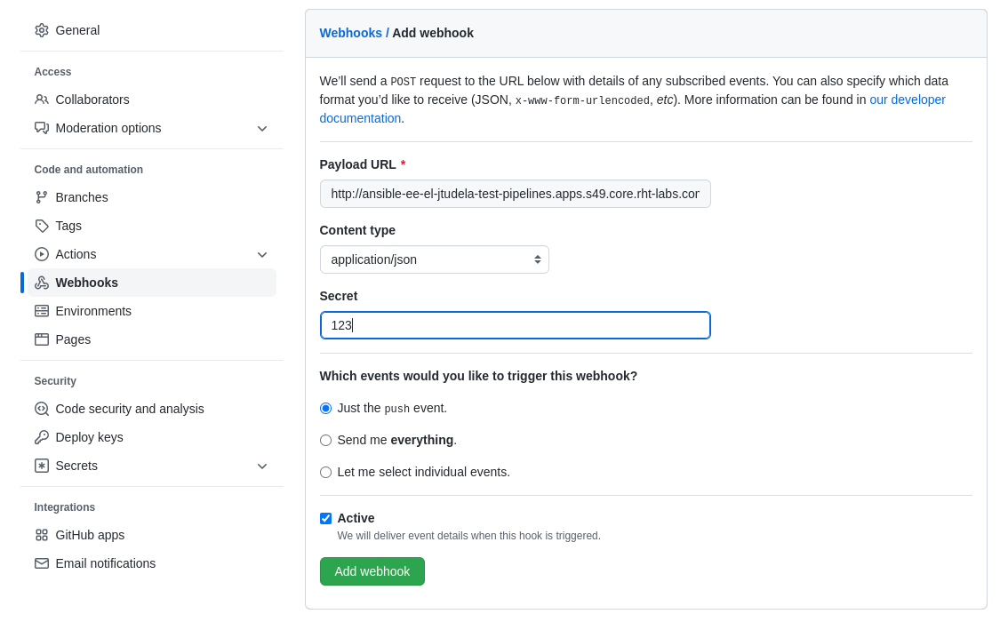
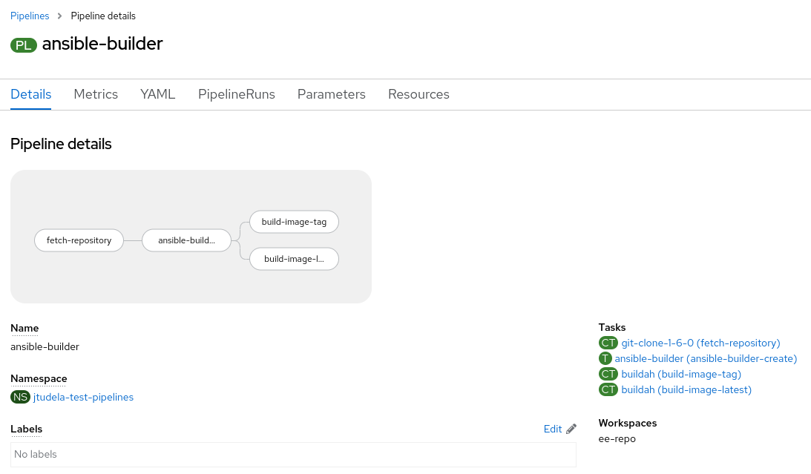
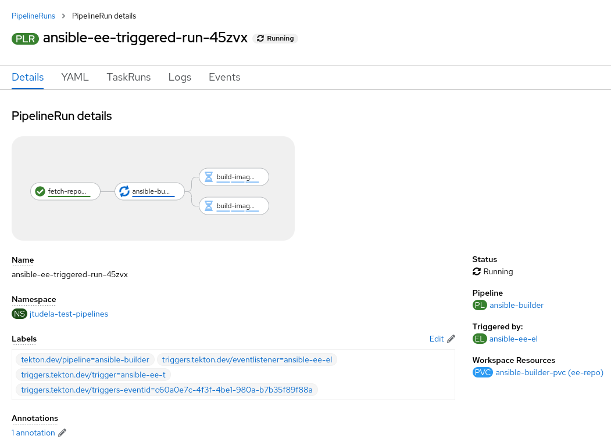
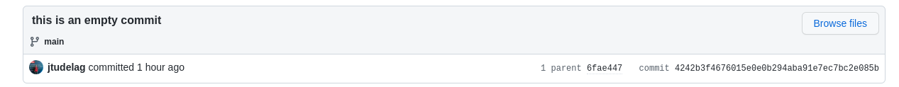
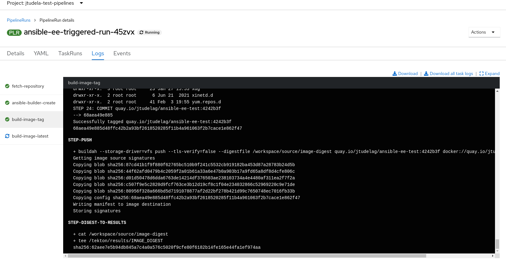
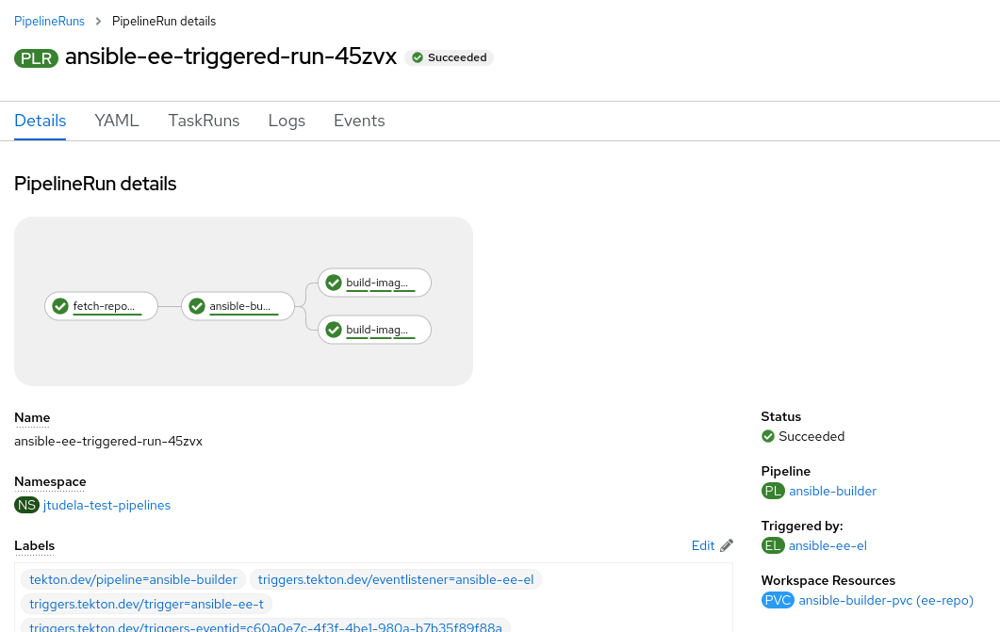

Jorge Tudela González de Riancho

At Red Hat Consulting we help customers to adopt Red Hat products and technologies and make the most out of them. We believe addressing customer business needs is the best way to increase customer's ROI.

Based on that premise, at Red Hat Consulting we have different consulting offerings such as the [Automation Adoption Journey](https://www.redhat.com/en/resources/services-journey-automation-adoption-brief) or the [Open Innovation Labs Residency](https://www.redhat.com/en/services/consulting/open-innovation-labs) that focus on outcomes and not outputs, aligning the technical solution with the customer business needs.

In order to reach the full potential of the solution built, we rely on practices from the Agile world, Devops, Product Development or Domain Driven Design, all of them curated in the [Open Practice Library](https://openpracticelibrary.com/).

In this article we are going to explain how to build [Ansible automation execution environments (EEs)](https://www.redhat.com/en/technologies/management/ansible/automation-execution-environments) automatically based on different practices such as [everything as code](https://openpracticelibrary.com/practice/everything-as-code/) and [continuous integration](https://openpracticelibrary.com/practice/continuous-integration/) on top of OpenShift.

Let's start by understanding EEs:
> Automation execution environments are container images on which all automation in Red Hat® Ansible® Automation Platform is run.

>They provide a defined, consistent, and portable environment for executing automation, and allow for easier administration of Ansible Automation Platform by the platform administrator.

The best way to build EEs is relying on a new tool provided by Red Hat® Ansible® Automation Platform, the [ansible-builder cli](https://www.ansible.com/blog/introduction-to-ansible-builder). In order to automate the build of EEs, we are going to rely as well on [OpenShift Pipelines](https://docs.openshift.com/container-platform/4.10/cicd/pipelines/understanding-openshift-pipelines.html).

In this article we will be working with two code repositories:

* <https://github.com/jtudelag/ansible-execution-environments>: Ansible execution environment code can be found here.
* <https://github.com/jtudelag/ansible-ee-gitops>: OpenShift Pipelines (Tekton) manifests can be found here.

The idea is that every time we make a change to the Ansible EE repo, this will trigger the OpenShift Pipeline to build and push the EE to our registry, in this case [quay.io](https://quay.io/).

# Applying OpenShift Pipelines Manifests

We need to clone the repo with the OpenShift Pipelines manifests, and apply them to your OpenShift cluster. But first we need to create the secrets to pull & push images to the registries and the Github webhook secret.

**NOTE:**
As this example is consuming images from [registry.redhat.io](https://registry.redhat.io) and pushing to [quay.io](https://quay.io), I recommend you use your [Red Hat pull secret](https://console.redhat.com/openshift/install/pull-secret). You can get it from [console.redhat.com](https://console.redhat.com).

Let's create the project `ansible-ees` and the secrets. Replace the secret data with your registry credentials.
```
oc new-project ansible-ees

cat << EOF > pull-and-push-secret.yaml
apiVersion: v1
data:
 .dockerconfigjson: XXXXXX
kind: Secret
metadata:
 annotations:
   tekton.dev/docker-0: quay.io
   tekton.dev/docker-1: registry.redhat.io
 name: pull-and-push
type: kubernetes.io/dockerconfigjson
EOF

oc -n ansible-ees apply -f pull-and-push-secret.yaml

# Link the secret to the pipeline SA, for pulling & pushing
oc secret link pipeline pull-and-push --for=pull,mount

cat << EOF > github-secret.yaml
apiVersion: v1
kind: Secret
metadata:
 name: ansible-ee-trigger-secret
type: Generic
stringData:
 secretToken: "123"
EOF

oc -n ansible-ees apply -f github-secret.yaml
```

**NOTE:** For the sake of security, the secrets are not included in the repo, hence they need to be created manually.

Now we can clone the repo and apply the Pipeline manifests.
```
git clone https://github.com/jtudelag/ansible-ee-gitops.git

cd ansible-ee-gitops

oc -n ansible-ees apply -f listener/
```

This will create the following manifests in the `ansible-ees` namespace.
```
listener/
├── 0-pvc.yaml
├── 2-task-ansible-builder-create.yaml
├── 3-pipeline-ansible-builder.yaml
├── 4-trigger-binding.yaml
├── 5-trigger-template.yaml
├── 6-trigger.yaml
├── 7-event-listener.yaml
└── 8-el-route.yaml
```

**NOTE:**
The task `ansible-builder` included in the repo mentioned above has been contributed upstream and can be found already in [Tekton Hub](https://hub.tekton.dev/tekton/task/ansible-builder).

# Creating Github Webhook

As we want to automate the whole process, we are relying on the [Trigger & Listener](https://cloud.redhat.com/blog/guide-to-openshift-pipelines-part-6-triggering-pipeline-execution-from-github) capabilities of OpenShift Pipelines. So every time we commit something to the EE repo, this will trigger a Github webhook that will call the EventListener and trigger the Pipeline with the right parameters, some of them extracted from the webhook payload.

So we need to configure such a webhook in Github to point to the url of the EventListener. We can check the url in the OpenShift console. You can get your OpenShift console by executing this command:

```
oc whoami --show-console
```



Remember to set the Github webhook secret accordingly to the OpenShift secret referenced in the Trigger object. In this case is a dummy "123" string.



Now, we just need to make a commit to the EE code repo and see how the pipeline is being triggered. The [pipeline](https://github.com/jtudelag/ansible-ee-gitops/blob/v0.1/listener/3-pipeline-ansible-builder.yaml) is very simple, it contains just four steps (tasks):

1. Fetch code.
2. Build EE context with the ansible-builder tool.
3. Build and push the container image tagged with the commit `SHA256` id.
4. Build and push the container image tagged with `latest`.

We can visually check the Pipeline details in the OpenShift console.



# Triggering the Pipeline on every commit

We can easily simulate a change in the code by committing a empty change to the repo:

```
git clone https://github.com/jtudelag/ansible-execution-environments.git

cd ansible-execution-environments

git commit --allow-empty -m "this is an empty commit"

git push origin main
```

This will trigger the Pipeline and as result produce a PipelineRun object, which is an instance of a Pipeline properly parametrized with all the input parameters required.



Some of those parameters are gathered from the Github webhook payload. You can inspect the [TriggerBinding](https://github.com/jtudelag/ansible-ee-gitops/blob/v0.1/listener/4-trigger-binding.yaml) and the [Trigger](https://github.com/jtudelag/ansible-ee-gitops/blob/v0.1/listener/6-trigger.yaml) objects for more details.

We can see that the commit id `4242b3f` matches the tag of the image built and pushed to [https://quay.io/repository/jtudelag/ansible-ee-test:4242b3f](https://quay.io/repository/jtudelag/ansible-ee-test?tab=tags).





We can also see that the `latest` tag has been updated in as well in [quay.io](https://quay.io/repository/jtudelag/ansible-ee-test?tab=tags).


Finally we can verify the PipelineRun has succeeded, meaning all the tasks of the Pipeline finished ok!



# Conclusion

In this article we have demonstrated how you can leverage Openshift & Ansible capabilities to…..[put sth together here]

Ask an expert! Need help to get it done faster together? Contact [hello-labs-emea@redhat.com](hello-labs-emea@redhat.com).
