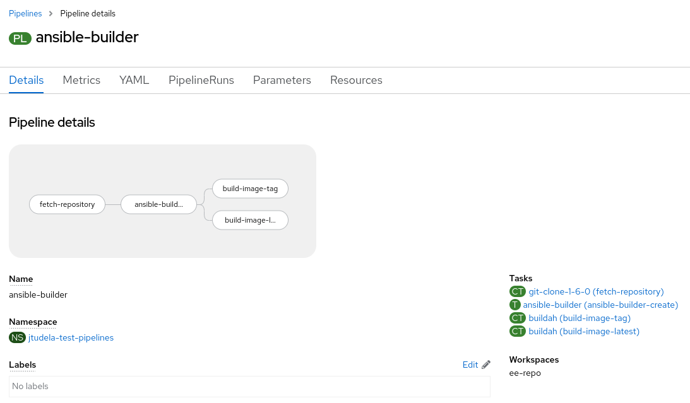
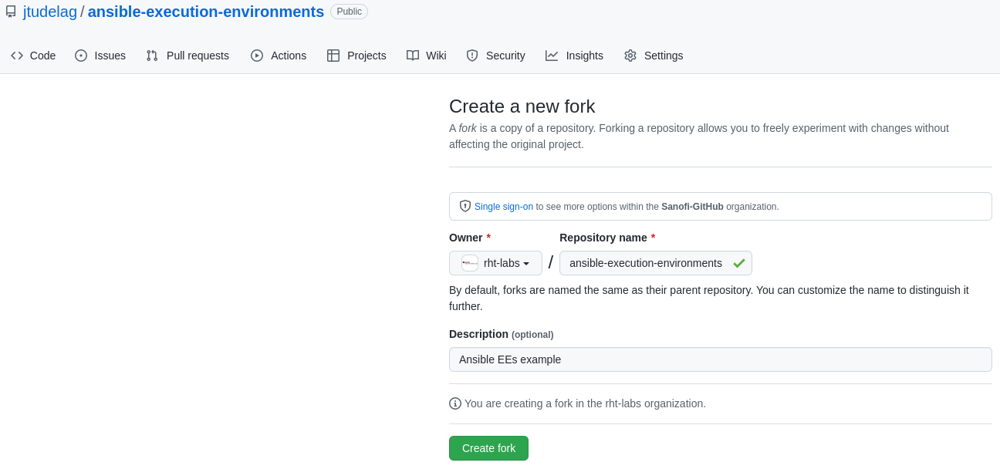
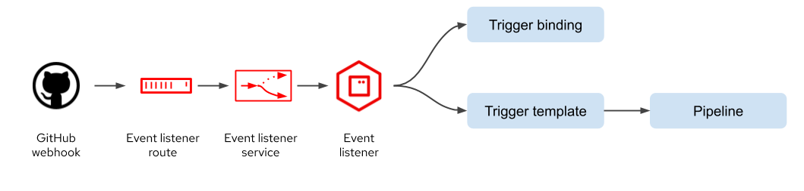
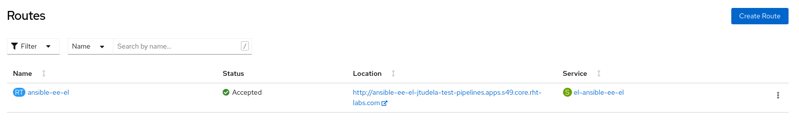
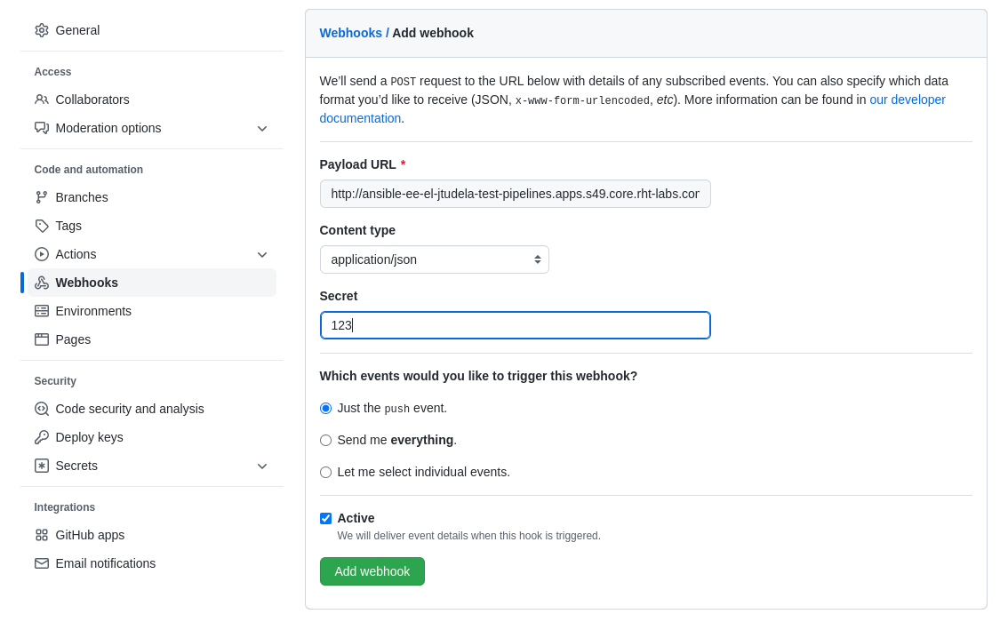
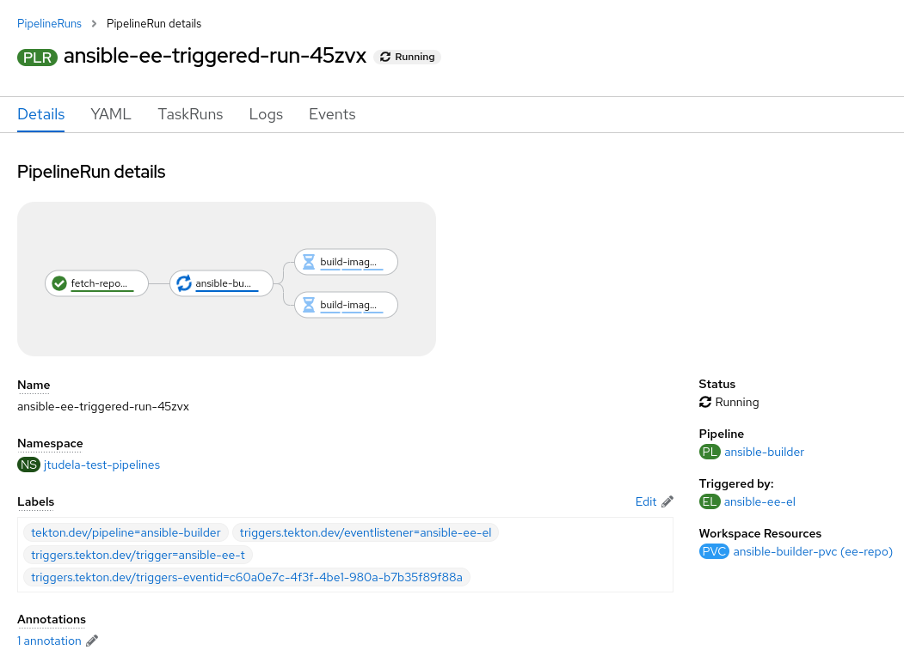
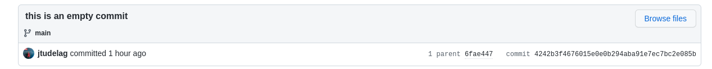
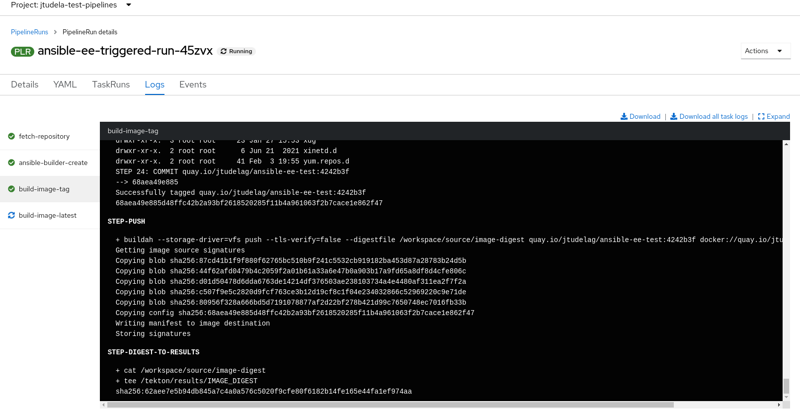
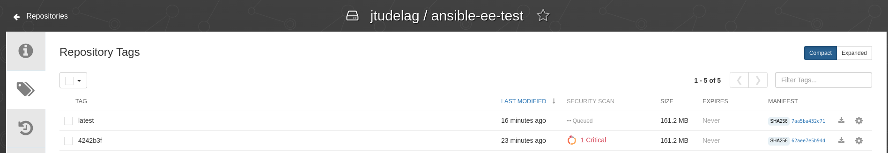
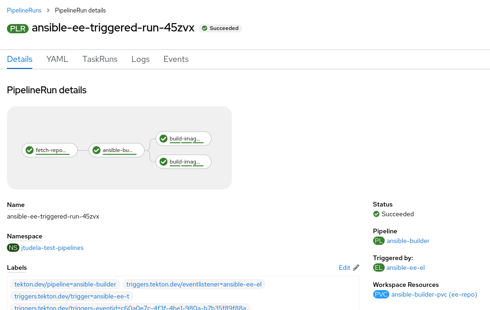

Jorge Tudela González de Riancho

At [Red Hat Consulting](https://www.redhat.com/en/services/consulting) we help customers to adopt Red Hat products and technologies and make the most out of them. We believe addressing customer business needs is the best way to increase customer's ROI.

Based on that premise, at Red Hat Consulting we have different consulting offerings such as the [Automation Adoption Journey](https://www.redhat.com/en/resources/services-journey-automation-adoption-brief) or the [Open Innovation Labs Residency](https://www.redhat.com/en/services/consulting/open-innovation-labs) that focus on outcomes and not outputs, aligning the technical solution with the customer business needs.

We rely on practices from the Agile world, Devops, Product Development or Domain Driven Design, all of them curated in the [Open Practice Library](https://openpracticelibrary.com/), to achieve the desired outcomes.

In this article we are going to explain how to build [Ansible automation execution environments (EEs)](https://www.redhat.com/en/technologies/management/ansible/automation-execution-environments) automatically, based on different practices such as [everything as code](https://openpracticelibrary.com/practice/everything-as-code/) and [continuous integration](https://openpracticelibrary.com/practice/continuous-integration/) on top of OpenShift.

Let's start by understanding EEs:
> Automation execution environments are container images on which all automation in Red Hat® Ansible® Automation Platform is run.

>They provide a defined, consistent, and portable environment for executing automation, and allow for easier administration of Ansible Automation Platform by the platform administrator.

The best way to build EEs is relying on a new tool provided by [Red Hat® Ansible® Automation Platform](https://www.redhat.com/en/technologies/management/ansible), the [ansible-builder cli](https://www.ansible.com/blog/introduction-to-ansible-builder). In order to automate the build of EEs, we make use of [OpenShift Pipelines](https://docs.openshift.com/container-platform/4.10/cicd/pipelines/understanding-openshift-pipelines.html) as well.

In this article we will be working with two code repositories:

* <https://github.com/jtudelag/ansible-execution-environments/tree/v0.1>: Ansible execution environment code can be found here.
* <https://github.com/jtudelag/ansible-ee-gitops/tree/v0.2>: OpenShift Pipelines (Tekton) manifests can be found here.

The idea is that every time we make a change to the Ansible EE repo, this will trigger the OpenShift Pipeline to build and push the EE to our registry, in this case [quay.io](https://quay.io/).

**NOTE:** Please check [Trigger Pipeline Execution From GitHub](https://cloud.redhat.com/blog/guide-to-openshift-pipelines-part-6-triggering-pipeline-execution-from-github) article for more details on how OpenShift Pipelines works.

# Applying OpenShift Pipelines Manifests

We need to clone the OpenShift Pipelines manifests repo and apply them to the OpenShift cluster. But first we need to create the secrets to pull & push images to the registries and the Github webhook secret.

## Create Secrets

**NOTE:**
As this example is consuming images from [registry.redhat.io](https://registry.redhat.io) and pushing to [quay.io](https://quay.io), I recommend you use your [Red Hat pull secret](https://console.redhat.com/openshift/install/pull-secret). You can get it from [console.redhat.com](https://console.redhat.com).

For the sake of security, the secrets are not included in the repo, we need to create them manually.

First create the project.
```bash
oc new-project ansible-ees
```

Then create the pull & push secret. Replace the secret data with your registry credentials!.
```bash
cat << EOF > pull-and-push-secret.yaml
apiVersion: v1
data:
 .dockerconfigjson: XXXXXX
kind: Secret
metadata:
 annotations:
   tekton.dev/docker-0: quay.io
   tekton.dev/docker-1: registry.redhat.io
 name: pull-and-push
type: kubernetes.io/dockerconfigjson
EOF

oc -n ansible-ees apply -f pull-and-push-secret.yaml

# Link the secret to the pipeline SA, for pulling & pushing
oc secret link pipeline pull-and-push --for=pull,mount
```

Create Github webhook secret.
```bash
cat << EOF > github-secret.yaml
apiVersion: v1
kind: Secret
metadata:
 name: ansible-ee-trigger-secret
type: Generic
stringData:
 secretToken: "123"
EOF

oc -n ansible-ees apply -f github-secret.yaml
```

## Apply the ansible-builder Tekton Task

The `ansible-builder` Tekton task has been contributed upstream and can be found in [Tekton Hub](https://hub.tekton.dev/tekton/task/ansible-builder).

Apply it to the cluster in the `ansible-ees` namespace.
```bash
oc -n ansible-ees apply -f https://raw.githubusercontent.com/tektoncd/catalog/main/task/ansible-builder/0.1/ansible-builder.yaml
```

## Apply Pipeline Manifests

Now we can clone the Pipeline manifests repo and apply them to the cluster.
```bash
git clone --branch v0.2 https://github.com/jtudelag/ansible-ee-gitops.git

cd ansible-ee-gitops
```

Edit the Trigger Template `listener/4-trigger-template.yaml` and change the PipelineRun `NAME` parameter to set the image repository name.

**NOTE:** Remember the parameter `TAG` is extracted from the webhook payload, so don't need to touch it.

```yaml
- apiVersion: tekton.dev/v1beta1
  kind: PipelineRun
  metadata:
    annotations:
    labels:
      tekton.dev/pipeline: ansible-builder
    generateName: ansible-ee-triggered-run-
  spec:
    params:
    - name: ANSIBLE_BUILDER_IMAGE
      value: >-
        registry.redhat.io/ansible-automation-platform-21/ansible-builder-rhel8:1.0.1-47
    - name: NAME
      value: XXXXXXXXXX
```

Apply the Pipeline related manifests.
```bash
oc -n ansible-ees apply -f listener/

persistentvolumeclaim/ansible-builder-pvc created
pipeline.tekton.dev/ansible-builder created
triggerbinding.triggers.tekton.dev/ansible-ee-tb created
triggertemplate.triggers.tekton.dev/ansible-ee-tt created
trigger.triggers.tekton.dev/ansible-ee-t created
eventlistener.triggers.tekton.dev/ansible-ee-el created
route.route.openshift.io/ansible-ee-el created
```

This will create the following manifests in the `ansible-ees` namespace.
```bash
listener/
├── 0-pvc.yaml
├── 2-pipeline-ansible-builder.yaml
├── 3-trigger-binding.yaml
├── 4-trigger-template.yaml
├── 5-trigger.yaml
├── 6-event-listener.yaml
└── 7-el-route.yaml
```

Basically we have created the [Tekton Pipeline](https://tekton.dev/docs/pipelines/) and the [Trigger & EventListener](https://tekton.dev/docs/triggers/) objects to be able to trigger the Pipeline on certain events, usually webhooks.

The [pipeline](https://github.com/jtudelag/ansible-ee-gitops/blob/v0.2/listener/2-pipeline-ansible-builder.yaml) is very simple, it contains just four steps (tasks):

1. Fetch code.
2. Build EE context with the ansible-builder tool. (using `ansible-builder` Tekton Hub task)
3. Build and push the container image tagged with the commit `SHA256` id.
4. Build and push the container image tagged with `latest`.

We can visually check the Pipeline details in the OpenShift console.



# Fork the EE Code Repository

Got to the [EE code repository](https://github.com/jtudelag/ansible-execution-environments) and fork it, so then you can change the repository webhook settings.



# Creating Github Webhook

As we want to automate the whole process, we are relying on the [Trigger & Listener](https://cloud.redhat.com/blog/guide-to-openshift-pipelines-part-6-triggering-pipeline-execution-from-github) capabilities of OpenShift Pipelines. Every time we commit something to the forked EE repo in Github, this will trigger a webhook that will call the EventListener and trigger the Pipeline with the right parameters, some of them extracted from the webhook payload.



We need to configure such a webhook in Github to point to the URL of the EventListener. We can get the EventListener route URL running the following command.
```bash
oc -n ansible-ees get route ansible-ee-el -o jsonpath="{.spec.host}"
```



Now go to your recently forked repo in Github, to `Settings` -> `Webhooks` -> `Add webhook` and create a new webook.

Set the following settings:

* Payload URL: EventListener URL obtained above. Don't forget to add http or https to it.
* Content type: application/json
* Secret: Set it accordingly to the OpenShift secret referenced in the Trigger object. In this case is a dummy "123" string.



Now we just need to make a commit to the forked EE code repo and see how the pipeline is being triggered ;).
# Triggering the Pipeline on every commit

We can easily simulate a change in the code by committing a empty change to your forked repo:
```bash
git clone https://github.com/<YOUR_FORK>/ansible-execution-environments.git

cd ansible-execution-environments

git commit --allow-empty -m "Empty commit, trigger the pipeline!"

git push origin main
```

This will trigger the Pipeline and as result produce a [PipelineRun](https://tekton.dev/docs/pipelines/pipelineruns/) object, which is an instance of a Pipeline properly parametrized with all the input parameters required.



Some of those parameters are gathered from the Github webhook payload. You can inspect the [TriggerBinding](https://github.com/jtudelag/ansible-ee-gitops/blob/v0.2/listener/3-trigger-binding.yaml) and the [Trigger](https://github.com/jtudelag/ansible-ee-gitops/blob/v0.2/listener/5-trigger.yaml) objects for more details.

We can see that the commit id `4242b3f` matches the tag of the image built and pushed to [https://quay.io/repository/jtudelag/ansible-ee-test:4242b3f](https://quay.io/repository/jtudelag/ansible-ee-test?tab=tags).





We can also see that the `latest` tag has been updated as well in [quay.io](https://quay.io/repository/jtudelag/ansible-ee-test?tab=tags).



Finally we can go to the Openshift console and verify the PipelineRun has succeeded, meaning all the tasks of the Pipeline finished ok!



# Conclusion

In this article we have demonstrated how Red Hat Consulting can help you make the most out of Red Hat products like Red Hat® Ansible® Automation Platform and Red Hat® OpenShift® to achieve your business outcomes leveraging on the curated set of [Open Practices](https://openpracticelibrary.com/).

Ask an expert! Need help to get it done faster together? Contact [hello-labs-emea@redhat.com](hello-labs-emea@redhat.com).